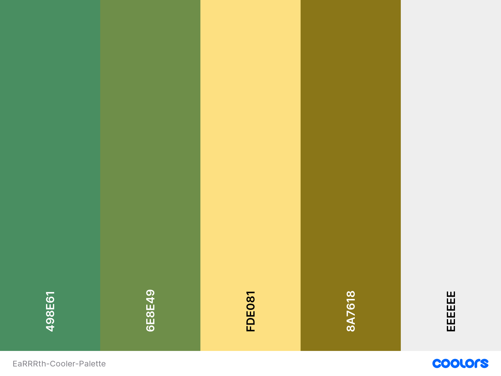

# **[EaRRRth](#)**
EaRRRth is an environmentaly focused, community based responsive web application where users can contribute their green objectives under the applications "Reuse, Reduce, Recycle" philosophy. Through this philosophy and the function of the site, users are able to select a contribution that they've made through the UI and add a comment to describe it. The users contribution is stored in a database and shown throughout the site. The community contributions are then counted and used as statistics throughout the site to promote more users to get involved.

## Table of contents
* ### [Deployed Site](#deployed-website)
* ### [Demo](#site-demonstration)
* ### [User Stories](#site-demonstration)
* ### [UX](#user-experience)
* ### [Design](#design-features)
* ### [Features](#functional-features)
* ### [Technologies](#technologies-used)
* ### [Testing](#testing)
* ### [Deployment](#local-deployment)
* ### [Further Development](#further-development-scope)
* ### [Team](#team-credits)

### Team

- **John Traas**
- **Joel Rutter**
- **John Muckian**
- **Noumair Rafiq**
- **Shaun Bonner**
- **Aws Sabah Gheni**
### Deployed Website
By clicking the hyperlinked header above, you can access the final deployed site hosted on Heroku.

### Site Demonstration 
 - WE NEED AN AM I RESPONSIVE IMAGE HERE, I'VE PRETTY GOOD A DOCTORING THESE SEEING AS IT DOESNT WORK FOR FULL STACK PROJECTS

## **User Stories**
Below are the user stories that needed to be fulfilled for the project to be successful from the perspective of the user and the store owner. There are 10 user stories in total broken down into three different epics:

| EaRRRth User Stories           |                           |                                                                   |                                                                        |                                               |
|--------------------------------|---------------------------|-------------------------------------------------------------------|------------------------------------------------------------------------|-----------------------------------------------|
| ID                             | As a….                    | I want to be able to….                                            | So that I can                                                          | Must have, should have, could have, wont have |
| Registering, log in & logout   |                           |                                                                   |                                                                        |                                               |
| 1                              | User                      | register easily for an account                                    | enter information into the site that will associate with my account.   | must have                                     |
| 2                              | User                      | login to my account                                               | enter a contribution  into the site.                                   | must have                                     |
| 3                              | User                      | logout of my account                                              | so that I can keep my account safe when I am not using the app.        | must have                                     |
| User profile and entry history |                           |                                                                   |                                                                        |                                               |
| 4                              | Registered User           | view my profile                                                   | so that I can see what I have done on the site in the past.            | must have                                     |
| 5                              | Registered User           | view my previous entries                                          | so that I can see what personal impact I have had on the environment.  | must have                                     |
| 6                              | Registered User           | add a profile avatar                                              | personalise my profile                                                 | should have                                   |
| User entries                   |                           |                                                                   |                                                                        |                                               |
| 7                              | Anonymous/Registered User | submit my eco contributions                                       | contribute to the site community and track how I help the environment. | must have                                     |
| 8                              | Anonymous/Registered User | choose the category of my contribution (reuse, recycle & reduce). | accuratley submit my contribution.                                     | must have                                     |
| 9                              | Registered User           | leave a message with my contribution                              | add a personal touch and include my contribution details.              | must have                                     |
| 10                             | Registered User           | add a photo with my contribution                                  | show the site community what I have done                               | could have                                    |

## **UX / Design**

The UX design for our site was initially conceptualied using balsamiq wireframes. You can find these wireframes [here](docs/wireframes).

### **Positioning**
All of our site elements were first postitioned using Bootstrap 5. This allows us to work responsively up from mobile first design. We then fine tuned element positioning and responsivenes using custom CSS.
### **Color Palette**

We used [Coolers](https://coolors.co/) to create this neat palette for our site. Detail on the use of each color below.


**#498E61 Middle Green:** This color is used as our primary green shade, used in the navigation, matched with the hero image, the Reduce tab and column and for submit form buttons.

**#6E8E49AD Maximum Green:** This color is used for our Reuse tabs and column. It contrasts nicely with our primary green to divide our RRR columns in a visully appealing way. It is made slightly transparent to lighten its shade.

**#FDE081AD Jasmine:** This color is used for our Recycle tab, again contrasting nicely with our other shades, giving its section some individuality. It is made slightly transparent for a lighter shade. It is also used for the Sign In, Register and Contribute buttons.

**#8A7618 Spanish Bistre:** This color is used for our hero image messages. It is a nice olive shade allowing the text and items in the container to pop. It is also used for Cancel buttons.

**#EEEEEE Cultured:** This color is used as a lower contrast background color in combination with a white backgroud to give a nice highlight to certain containers and add a touch more dynamism to the site.

### **Home**
The home page contains a hero image, chosen for its clean, minimalist visual appeal and its color scheme which meshes nicely with our sites color palette. The hero image contains our welcome message to new users, acting as an invitation and briefly explaining the purpose of the site and its intended use. The message terminates with a "Contribute" button.

Beneath the hero image, there is a dynamicly designed grid of site user statistics, showing off the contributions of active users to the EaRRRth community. The grid is intended to be eye catching, utilising different cell shapes, colors and icons used draw attention and denote the particular data on display. The stats in these cells are updated, using a Django context processor, every time a user makes a contribution to the specified category.

### **Contributions**
Our contributions page starts with a hero image and message box. The message box contains data specific to the individual RRR categories, specifically their total contributions. They are also complemented with corresponding icons for easy identification.

Next are the tabs for the three RRRs, nicely contrasting each other. Clicking a tab updates the R actions available to the user in the dropdown menu beneath. The user, if they have signed up or signed in, can leave a comment describing the specifics of their fulfillment of the R action they took. They can then click the "Submit" button to save to the sites database. This will update the site data for that R action and display on the home page infographic grid and the contributions page hero image message container. Alternatively, the user can clear the form using "Reset".

Members who added comments to their contributions have them categoried and displayed at the bottom of the page. These are available for all users to view.

### **Sign In / Register**
These pages present similarly, with a fun hero image filling the full background. In the top right is a message box containing the user forms, asking for either registration information or sign in membership information. User email is optional for users who do not wish to share. When the user types a username in the field, they are given a character count of 30. The user's keystrokes are tracked automatically counting down to 0 with each press. The user has an option to switch to the alternative form via a message link, as an alternative to using the navigation elements.

### **Profile**
The user profile contains a user avatar, a welcome banner containing the username or email used to sign up, the users R action totals and a sub-heading directing the user down to their contributions. The R actions are again divided between 3 contrasting tabs. If the user has not yet contributed, they have a link button directing them to the contributions page so they can get started. Each contribution displays the R action, action category, comment/description of the action and a date of posting.

### **Toasts**
User toasts provide extra dynamism to the site, giving the user extra feedback on their actions. They are linked to navigation elements and UI buttons, providing the user snippets of information based on the item they have clicked or the page they have loaded. The toasts are styles in line with the overall site theme with fun icons and words of encouragement to enhance the users journey.

### **Data Schema**

[Here](docs/data-schema/data_schema_plan.png) is the data schema draft we constructed for the initial planning faze of the project. The actual schema has been modified and adapted from this prototype.

## **Features**

### - Responsive Design
### - Responsive Navigation Bar
### - Reactive User Interface
### - Anonymous Contribution Functionality
### - Membership Create and Read Functionality
### - Data Context Controls for Data Infographics
### - Membership Profile Options
### - Contribution History

## **Technologies**

### Languages Used

-   [HTML](https://en.wikipedia.org/wiki/HTML5)
-   [CSS](https://en.wikipedia.org/wiki/Cascading_Style_Sheets)
-   [Javascript](https://en.wikipedia.org/wiki/JavaScript)
-   [Python](https://en.wikipedia.org/wiki/Python_(programming_language))

### Frameworks, Libraries & Programs Used

1. [Bootstrap:](https://getbootstrap.com/docs/4.4/getting-started/introduction/)
    - Bootstrap was used to assist with the responsiveness and styling of the website.
2. [Google Fonts:](https://fonts.google.com/)
    - Google fonts were used to import the 'Titillium Web' font into the style.css file which is used on all pages throughout the project.
3. [Font Awesome:](https://fontawesome.com/)
    - Font Awesome Icons was used throughout the website to add icons for aesthetic and UX purposes.
4. [jQuery:](https://jquery.com/)
    - jQuery is used for various elements to reduce use of raw javascript code.
5. [Git](https://git-scm.com/)
    - Git was used for version control by utilizing the Gitpod terminal to commit to Git and Push to GitHub.
6. [GitHub:](https://github.com/)
    - GitHub is used to store the projects code after being pushed from Git.
7. [Balsamiq:](https://balsamiq.com/)
    - Balsamiq was used to create the [wireframes](docs/wireframes) during the design process.
8. [Django:](https://docs.djangoproject.com/en/4.0/)
    - Django is a Python-based free and open-source web framework that follows the model–template–views (MTV) architectural pattern. It allows a user to quickly put together full stack applications with responsive frontend design and intuative backend controls.
9. [Heroku:](https://en.wikipedia.org/wiki/Heroku)
    - Heroku is a cloud platform as a service (PaaS) supporting several programming languages. It serves as the host platform for our website.

## **Testing**

### Home

#### Readability
Contrasting fonts and container colors, site's legibility, comprehension, language & grammar and ease of reading all considered and tested. Intended result achieved.
#### Accessibility
All page elements move and scale well when changing between screen sizes. No text or color overflow into wrong containers. Spacing between rows is maintained. No unintended effects detected. Navbar collapses as intended to burger horizontal lines on smaller screen widths.
#### Navigability
Clicking the site logo reloads the home page as intended. All buttons on navigation link to their intended location. Contribute button in hero message links to the contributions page as intended. Social media icons in footer working as intended. Privacy policy modal expands and collapsed correctly using UI buttons.

#### UX
The home page infographic grid updates its info based on users contributing as intended. Data is displaying in the specific categories as intended. Use of colors, shapes and imagery provides an enjoyable experience for the user. Toast messages working as intended.

### Contributions

#### Readability
Contrasting fonts and container colors, site's legibility, comprehension, language & grammar and ease of reading all considered and tested. Intended result achieved. 
#### Accessibility
All page elements move and scale well when changing between screen sizes. No text or color overflow into wrong containers. Spacing between rows is maintained. No unintended effects detected. Navbar collapses as intended to burger horizontal lines on smaller screen widths.
#### Navigability
Clicking the site logo reloads the home page as intended. All buttons on navigation link to their intended location. Social media icons in footer working as intended. Privacy policy modal expands and collapsed correctly using UI buttons.

#### Task Success
The user can click a tab, choose an action and fill in a description successfully. The Submit Contribution button works as intended and the contribution is added to the corresponding column on this page as well as the corresponding tab on the profile page. All user creations saved and displaying as intended.
#### UX
The hero image infographic stats updates its info based on users contributing as intended. User posts are displaying in their specific categories as intended. Use of colors, shapes and imagery provides an enjoyable experience for the user. Toast messages working as intended.

### Profile

#### Readability
Contrasting fonts and container colors, legibility, comprehension, language & grammar and ease of reading all considered and tested. Intended result achieved. 
#### Accessibility
All page elements move and scale well when changing between screen sizes. No text or color overflow into wrong containers. Spacing between rows is maintained. No unintended effects detected. Navbar collapses as intended to burger horizontal lines on smaller screen widths.
#### Navigability
Clicking the site logo reloads the home page as intended. All buttons on navigation link to their intended location. Tabs display correct info. Contribute button, when user has no previous posts, works as intended. Social media icons in footer working as intended. Privacy policy modal expands and collapsed correctly using UI buttons.

#### UX
The user icon, profile heading, user stats and R action tabs displaying correctly. User posts are displaying in their specific categories as intended. Use of colors, shapes and imagery provides an enjoyable experience for the user. Toast messages working as intended.

### Sign In / Out / Register

#### Readability
Contrasting fonts and container colors, legibility, comprehension, language & grammar and ease of reading all considered and tested. Intended result achieved.
#### Accessibility
All page elements move and scale well when changing between screen sizes. No text or color overflow into wrong containers. Spacing between rows is maintained. No unintended effects detected. Navbar collapses as intended to burger horizontal lines on smaller screen widths.
#### Navigability
Clicking the site logo reloads the home page as intended. All buttons on navigation link to their intended location. With appropriate form info inputted the user is linked to the Contributions page as intended. Sign up/sign in links on form work as intended. All form elements working as intended. Social media icons in footer working as intended. Privacy policy modal, in both page form and footer, expands and collapsed correctly using UI buttons.

#### UX
The form, form fields, form info and buttons are displaying correctly. Form contrasting with hero image as intended. Use of colors, shapes and imagery provides an enjoyable experience for the user. Toast messages working as intended.

## Deployment

### Local Deployment
 We used Gitpod for development, so the following steps will be specific to Gitpod. You will need to adjust them depending on your IDE. You can find more information about installing packages using pip and virtual environments [here](https://packaging.python.org/guides/installing-using-pip-and-virtual-environments/). This project can be run locally by following these steps:

1. From the application's repository, click the "code" button and download the zip of the repository. Alternatively, you can clone the repository using the following line in your terminal:
```
git clone https://github.com/JoelMichaelRutter/team-1-apr-hackathon-earth-day
```
2. Access the folder in your terminal window and install the application's link to re/reqquired modules using the following command:
```
pip3 install -r requirements.txt
```
3. In your IDE, create a file containing your environmental variables called env.py at the root level of the application. It will need to contain the following lines and variables:
```
import os

os.environ['SECRET_KEY'] = ''
os.environ['DEVELOPMENT'] = ''
os.environ['DATABASE_URL'] = ''
os.environ['CLOUDINARY_URL'] = ''
```
If you're not sure how to get the above Cloudinary variables, please visit the Cloudinary documentation. Also, if you plan on pushing this application to a public repository, ensure that env.py is added to your .gitignore file.


4. Migrate the database models with the following command:
```
python3 manage.py migrate
```
5. Create a superuser and set up the credentials with the following command
```
python3 manage.py createsuperuser
```
6. Run the app with the following command
```
python manage.py runserver
```
The address to access the website is displayed in the terminal.
Add /admin to the end to access the admin panel with your superuser credentials.

### Heroku Deployment
1. Login to your Heroku account and create a new app. Choose your region. 
2. Once the app is created click on the resources button and under Add-ons, look for the Heroku Postgres to attach a postgres database to your project.
    Select the Hobby Dev - Free plan and click 'Submit order form'

    

3. Scroll back up and click "settings". Scroll down and click "Reveal config vars". Set up the same variables as in your env.py () 

**NOTE: you will not need the DEVELOPMENT variable on Heroku as this sets DEBUG to True - The deployed app must have DEBUG set to False:

    ```
    SECRET_KEY = '<your secret key>'
    DATABASE_URL = '<your database URI - Heroku usually automatically sets this when you add the postgres addon>'
    CLOUDINARY_URL = '<your cloudinary url - remember to remove the initial CLOUDINARY_URL= from the URI that you get from cloudinary>'
    
    ```
4. From this screen, copy the value of DATABASE_URL
5. After this go to your settings.py the "" directory and comment out the default database configuration and add:
    ```
    DATABASES = {
        'default': dj_database_url.parse('Put your DATABASE_URL here'))
    }
    ```
6. Migrate again with the following command
    ```
    python3 manage.py migrate
    ```


7. Create a superuser for the postgres database so you can have access to the django admin by setting up the credentials with the following command
    ```
    python3 manage.py createsuperuser
    ```

    --> Don't forget to login to the admin page and check the boxes 'Verified and primary"

8. If you have data fixtures load the data into your newly created database by using the following command: 

    ```
    python3 manage.py loaddata <name of file containing the data *>
    ``` 


9. After migrations are complete, change database configurations to:
```
    if 'DATABASE_URL' in os.environ:
        DATABASES = {
            'default': dj_database_url.parse(os.environ.get('DATABASE_URL'))
        }
    else:
        DATABASES = {
            'default': {
                'ENGINE': 'django.db.backends.sqlite3',
                'NAME': os.path.join(BASE_DIR, 'db.sqlite3'),
            }
        }
```
This set up will allow your site to use Postgres in deployment and sqlite3 in development.


10. Make sure you have your requirements.txt file and your Procfile. In case you don't, follow the below steps:
    Requirements:
    ```
    pip3 freeze --local > requirements.txt
    ```
    Procfile:
    ```
    echo web: python app.py > Procfile
    ```
11. The Procfile should contain the following line where <project_name> is the name of your root app locally:
    ```
    web: gunicorn <project_name>.wsgi:application

    ```

12. Add your files and commit them to GITHUB by running the following commands:
    ```
    git add . 
    git commit -m "Your commit message"
    git push
    ```

13. Add your Heroku app URL to ALLOWED_HOSTS in your settings.py file
14. Login to heroku and enter your details, command: heroku login -i
15. Get your app name from heroku, command:  heroku apps
16. Set the heroku remote. (Replace <app_name> with your actual app name), command: heroku git:remote -a <app_name>
17. Add, commit and push to github, command: git add . && git commit -m "Deploy to Heroku via CLI"
18. Push to both github and heroku, 
- command: git push origin main 
- command: git push heroku main

MFA/2FA enabled?
*  Click on Account Settings (under the avatar menu)
*  Scroll down to the API Key section and click Reveal. Copy the key.
*  Enter the command:  heroku_config , and enter your api key you copied when prompted
*  Complete the steps 14 - 18 above, if you see an input box at the top middle of the editor...   a. enter your heroku username   b. enter the api key you just copied
*  Need to deploy again? You should just be able to add, commit and push, and if prompted enter your username and api key again.
19. Disable collect static so that Heroku doesn't try to collect static files during the initial deployment when you deploy by typing the following command in the terminal
    ```
    heroku config:set DISABLE_COLLECTSTATIC=1
    ```
20. If ready for final deployment, ensure DEBUG is False, remove DISABLE_COLLECTSTATIC from heroku Config vars and repeat steps 14-18 

## **References**
Our privacy policy was generated with this [link](https://app.freeprivacypolicy.com/download/5e14f11c-1d94-47f0-aa11-5e6394210b25) on [freeprivacypolicy.com](https://app.freeprivacypolicy.com/).

### Media

-   All Images were sourced online from sources using creative commons licences or from royalty free sites like Pixabay, Stockvault and Pexels.

### Acknowledgements

- A big thank you to the Slack community, mentors and community managers. There is great value in the community they've helped foster and coding is so much less stressful knowing we have the help we have.

- Thanks to Dave Horrocks for his guidance and support in this Hackathon project. Cheers Dave! It was a blast!